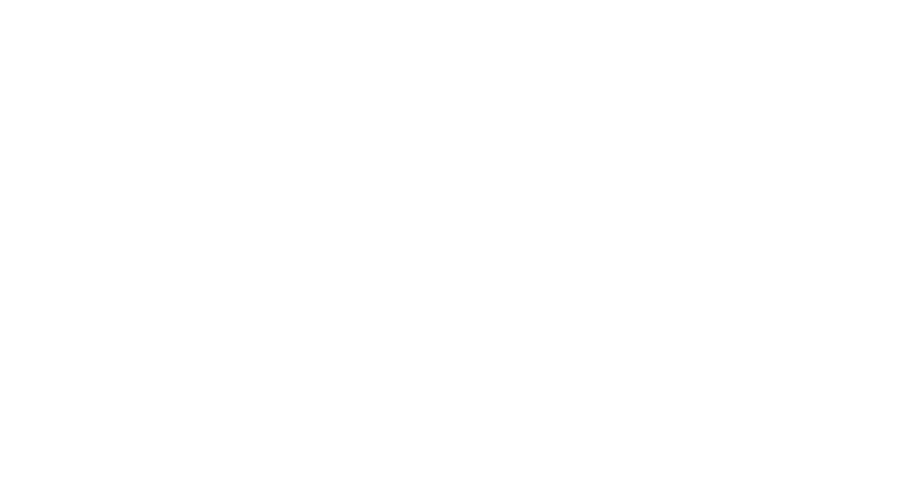
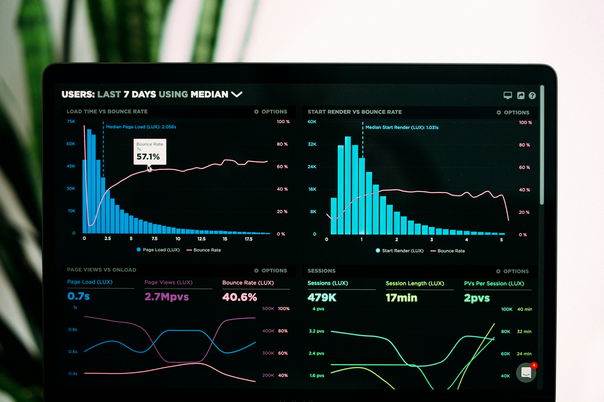

```{=html}
<link rel="stylesheet" href="https://cdnjs.cloudflare.com/ajax/libs/animate.css/4.1.1/animate.min.css"/>
<link href="https://fonts.googleapis.com/css2?family=Urbanist:wght@100;400;700;900&family=Nunito+Sans:wght@300;400;600;700&display=swap" rel="stylesheet">

<!-- Hero con fondo animado css-doodle -->
<div class="hero-cvea intro_f cvea-intro">
  <div class="hero-doodle-bg" aria-hidden="true">
    <css-doodle>
      <style>
        @grid: 30x1 / 100vmax;
        :container { perspective: 22vmin; }
        background: @m(
          @r(180, 220),
          radial-gradient(
            @p(#38666A, #4a7d82, #2d5054, #5a9a9e, #1e3d40, #6bb5b9, #7bc4c8) 15%,
            transparent 45%
          ) @r(100%) @r(100%) / @r(1%, 4%) @lr no-repeat
        );
        @size: 50%;
        @place-cell: center;
        border-radius: 50%;
        transform-style: preserve-3d;
        animation: scale-up 28s linear infinite;
        animation-delay: calc(@i * -.35s);
        @keyframes scale-up {
          0% { opacity: 0; transform: translate3d(0, 0, 0) rotate(0); }
          12% { opacity: 0.8; }
          90% { transform: translate3d(0, 0, @r(50vmin, 58vmin)) rotate(@r(-360deg, 360deg)); }
          100% { opacity: 0; transform: translate3d(0, 0, 1vmin); }
        }
      </style>
    </css-doodle>
  </div>
  <div class="hero-cvea-content">
    <a href="index.html">
      
    </a>
    <p class="hero-rotate-line">
      <span class="txt-rotate" data-period="2000" data-rotate='[
        "Actuaría",
        "Seguros de vida",
        "Pensiones",
        "Riesgo financiero",
        "Matemáticas actuariales",
        "Reservas técnicas",
        "Tarificación",
        "Series de tiempo",
        "Modelos de supervivencia",
        "Machine Learning actuarial"
      ]'></span>
    </p>
    <a href="#bloque-academico" class="btn-21 animate__animated animate__zoomInUp" style="margin-top: 1.5rem; text-decoration: none; color: white;"><span>Conocer más</span></a>
  </div>
</div>
```

```{=html}
<nav class="portal-nav-bar" aria-label="Navegación principal">
  <div class="portal-nav-bar-inner">
    <a href="index.html" class="active">Inicio</a><span class="sep">·</span>
    <a href="sobre-cortex.html">Sobre Cortex</a><span class="sep">·</span>
    <a href="miembros.html">Miembros</a><span class="sep">·</span>
    <a href="resources/index.html">Resources</a><span class="sep">·</span>
    <a href="cortex-suite.html">Cortex Suite</a><span class="sep">·</span>
    <a href="docencia/index.html">Cursos</a><span class="sep">·</span>
    <a href="actualidad.html">Actualidad</a><span class="sep">·</span>
    <a href="contacto.html">Contacto</a>
  </div>
</nav>
```

```{=html}
<!-- Sección intro (slideshow + cita) -->
<div class="intro intro_f" style="background-color: black;">
  <div class="intro-slideshow">
    <div class="image-wrapper">
      
    </div>
  </div>
  <div class="scroll-text intro-text">
    <div class="quote-wrapper">
      <div class="quote-content">
        <div class="quote-img">
          <svg xmlns="http://www.w3.org/2000/svg" viewBox="0 0 100 125" class="svg-quote" style="width: 60px; height: auto;"><path fill="#FFFFFF" fill-rule="evenodd" d="M6.438,50.5v35.875h35.875V50.5h-20.5c0-11.321,9.179-20.5,20.5-20.5V14.625C22.498,14.625,6.438,30.686,6.438,50.5z M93.562,30V14.625c-19.814,0-35.875,16.061-35.875,35.875v35.875h35.875V50.5h-20.5C73.062,39.179,82.241,30,93.562,30z"/></svg>
        </div>
        <p class="quote-copy" style="color:white;"><i>Compartir conocimiento y herramientas para fortalecer la práctica actuarial.</i></p>
        
      </div>
    </div>
  </div>
  <div class="intro-header">
    <p class="scroll-text" id="main">Actuarial Cortex se articula en tres ejes: Conocimiento · Tecnología · Formación</p>
  </div>
</div>

<!-- Cita móvil -->
<div class="quote-container-bg">
  <div class="layout_grid_objectives_mob">
    <div class="quote-container">
      <h1 class="quote-text scroll-text" style="color:white;">Actuarial Cortex se articula en tres ejes: Conocimiento · Tecnología · Formación</h1>
      
    </div>
  </div>
</div>

<!-- Bloque A: Ejes Académicos (El Núcleo Universitario) — iconos uno debajo del otro -->
<div class="container-blue" id="bloque-academico">
  <p style="text-align:center; color: white; margin-bottom: 1rem;"><strong>Ejes Académicos</strong> — La razón de ser del centro y su producción intelectual.</p>
  <div class="layout_grid_objectives">
    <div class="achievements">
      <a href="#identidad" class="work work-link">
        <div class="work-icon">
          <lord-icon src="https://cdn.lordicon.com/zjscbpdr.json" trigger="loop" delay="250" colors="primary:#30c9e8,secondary:#38666A" style="width:100px;height:100px"></lord-icon>
          <p class="work-heading scroll-text">Inicio</p>
        </div>
        <div class="work-description">
          <p class="work-text scroll-text">Identidad institucional y enlaces rápidos.</p>
        </div>
      </a>
      <a href="sobre-cortex.html" class="work work-link">
        <div class="work-icon">
          <lord-icon src="https://cdn.lordicon.com/zjscbpdr.json" trigger="loop" delay="250" colors="primary:#30c9e8,secondary:#38666A" style="width:100px;height:100px"></lord-icon>
          <p class="work-heading scroll-text">Sobre Cortex</p>
        </div>
        <div class="work-description">
          <p class="work-text scroll-text">Identidad, ejes del hub y propósito.</p>
        </div>
      </a>
      <a href="investigacion/index.html" class="work work-link">
        <div class="work-icon">
          <lord-icon src="https://cdn.lordicon.com/nocovwne.json" trigger="loop" delay="250" colors="primary:#30c9e8,secondary:#104891" style="width:100px;height:100px"></lord-icon>
          <p class="work-heading scroll-text">Investigación</p>
        </div>
        <div class="work-description">
          <p class="work-text scroll-text">Resources y Model Hub. Producción científica.</p>
        </div>
      </a>
      <a href="docencia/index.html" class="work work-link">
        <div class="work-icon">
          <lord-icon src="https://cdn.lordicon.com/flvisirw.json" trigger="loop" delay="250" colors="primary:#d1e3fa,secondary:#38666A" style="width:100px;height:100px"></lord-icon>
          <p class="work-heading scroll-text">Docencia</p>
        </div>
        <div class="work-description">
          <p class="work-text scroll-text">Formación continua, Series de Tiempo y recursos pedagógicos.</p>
        </div>
      </a>
      <a href="servicios/index.html" class="work work-link">
        <div class="work-icon">
          <lord-icon src="https://cdn.lordicon.com/jkzrgmvk.json" trigger="loop" delay="400" colors="primary:#38666A,secondary:#30c9e8" style="width:100px;height:100px"></lord-icon>
          <p class="work-heading scroll-text">Extensión</p>
        </div>
        <div class="work-description">
          <p class="work-text scroll-text">Consultoría estratégica, demos y vinculación con la industria.</p>
        </div>
      </a>
      <a href="observatorio.html" class="work work-link">
        <div class="work-icon">
          <lord-icon src="https://cdn.lordicon.com/gkstbnbz.json" trigger="loop" delay="1000" colors="primary:#38666A" style="width:100px;height:100px"></lord-icon>
          <p class="work-heading scroll-text">Observatorio</p>
        </div>
        <div class="work-description">
          <p class="work-text scroll-text">Variables biométricas, financieras y de previsión. Indicadores dinámicos.</p>
        </div>
      </a>
    </div>
  </div>
</div>

<!-- Bloque B: Gestión y Vinculación (El Motor Operativo) — imágenes una al lado de la otra -->
<p style="text-align:center; margin-top: 2rem;"><strong>Gestión y Vinculación</strong> — Sostenibilidad, dinamismo y comunicación con el entorno.</p>
<div class="wrap">
  <div class="tile">
    
    <a href="resources/index.html">
      <div class="text">
        <h1>Resources</h1>
        <p class="animate-text">Materiales académicos, proceso de revisión y Call for Papers.</p>
        <div class="dots"><span></span><span></span><span></span></div>
      </div>
    </a>
  </div>
  <div class="tile">
    
    <a href="docencia/index.html#cursos">
      <div class="text">
        <h1>Cursos</h1>
        <p class="animate-text">Rutas de aprendizaje en R y Python: fundamentos, datos, modelado actuarial y ML.</p>
        <div class="dots"><span></span><span></span><span></span></div>
      </div>
    </a>
  </div>
  <div class="tile">
    
    <a href="cortex-suite.html">
      <div class="text">
        <h1>Cortex Suite</h1>
        <p class="animate-text">Plataforma modular: tecnología a medida y analítica de alto nivel para su operatividad.</p>
        <div class="dots"><span></span><span></span><span></span></div>
      </div>
    </a>
  </div>
  <div class="tile">
    
    <a href="actualidad.html">
      <div class="text">
        <h1>Actualidad</h1>
        <p class="animate-text">Noticias del sector, eventos académicos y crónicas institucionales.</p>
        <div class="dots"><span></span><span></span><span></span></div>
      </div>
    </a>
  </div>
  <div class="tile">
    
    <a href="contacto.html">
      <div class="text">
        <h1>Contacto / Soporte</h1>
        <p class="animate-text">Solicitudes de investigación, consultoría y soporte técnico.</p>
        <div class="dots"><span></span><span></span><span></span></div>
      </div>
    </a>
  </div>
</div>

<script src="https://cdn.lordicon.com/ritcuqlt.js"></script>
<script src="assets/js/text_obs.js"></script>
<script src="assets/js/text_obs_achiev.js"></script>
<script src="assets/js/text.js"></script>
<script src="assets/js/background.js"></script>
```

::: {.column-page .acceso-rapido-contenido #identidad}

## Inicio — Identidad y propósito

**Actuarial Cortex** es un **hub personal de conocimiento y tecnología actuarial** impulsado por el Prof. **Angel Colmenares**. Con un enfoque en **Conocimiento — Tecnología — Formación**, integra modelos, herramientas y materiales docentes aplicados a seguros, pensiones, riesgo financiero y ciencia de datos, sirviendo de puente entre la academia y la práctica profesional.

- **Sobre Cortex:** Identidad, ejes del hub (conocimiento aplicado, tecnología y demos, formación continua). [Ver página Sobre Cortex](sobre-cortex.qmd).
- **Nuestro Equipo:** Perfiles del equipo central, colaboradores y profesores del departamento. [**Miembros**](miembros.qmd).
- **Materiales y sello editorial:** Recursos académicos y plantillas. [Resources — Materiales académicos](resources/index.qmd).

## Enlaces rápidos

- [**Investigación**](investigacion/index.qmd) — Resources, Model Hub
- [**Docencia**](docencia/index.qmd) — Cursos, recursos, próximas ofertas
- [**Extensión / Servicios**](servicios/index.qmd) — Consultoría, demos, observatorio
- [**Cortex Suite**](cortex-suite.qmd) — Plataforma modular: tecnología a medida y analítica para su operatividad
- [**Observatorio**](observatorio.qmd) — Variables biométricas, financieras y de previsión
- [**Actualidad**](actualidad.qmd) — Noticias, eventos, Call for Papers
- [**Contacto**](contacto.qmd) — Solicitudes y soporte

## Últimas noticias del sector

Titulares recientes (seguros y actuarial). [**Ver todas en Actualidad**](actualidad.qmd#noticias-tiempo-real).

```{r}
#| label: inicio-noticias-teaser
#| echo: false
#| results: asis
#| cache: false
url_rss <- "https://news.google.com/rss/search?q=seguros+actuarial&hl=es"
tryCatch({
  xml <- xml2::read_xml(url_rss, options = c("NOBLANKS", "NOCDATA"),
    user_agent = "Mozilla/5.0 (compatible; ActuarialCortex/1.0)")
  items <- xml2::xml_find_all(xml, "//item")[1:min(3, length(xml2::xml_find_all(xml, "//item")))]
  if (length(items) == 0) stop("No items")
  cat('<ul class="list-unstyled">\n')
  for (it in items) {
    title <- xml2::xml_text(xml2::xml_find_first(it, "title"))
    link  <- xml2::xml_text(xml2::xml_find_first(it, "link"))
    if (is.na(link)) link <- "https://news.google.com/search?q=seguros+actuarial&hl=es"
    cat(sprintf('  <li class="mb-1"><a href="%s" target="_blank" rel="noopener">%s</a></li>\n', link, title))
  }
  cat('</ul>\n')
}, error = function(e) {
  cat('<p class="text-muted small">Ver noticias en <a href="actualidad.qmd#noticias-tiempo-real">Actualidad</a>.</p>')
})
```

:::
