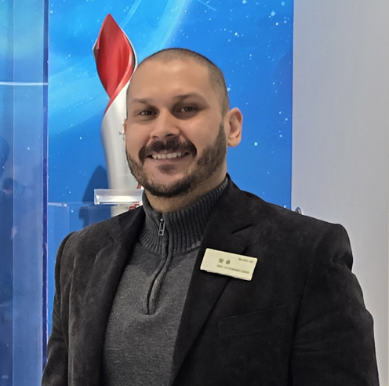
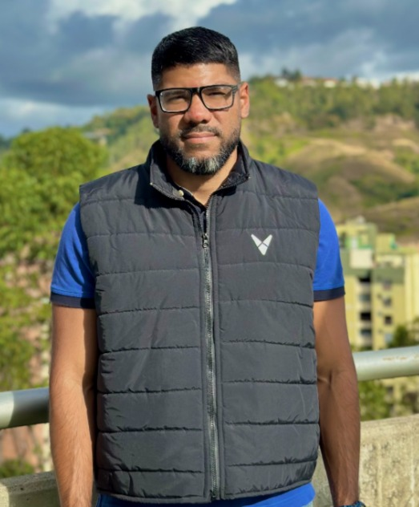

El ecosistema que da vida a **Actuarial Cortex** se apoya en una red de **actuarios, estadísticos y especialistas en datos** con experiencia en diversos sectores —asegurador, banca, previsión social, políticas públicas y ciencia de datos—, lo que permite una visión plural sobre el riesgo, la modelización y la toma de decisiones. A continuación se presentan los perfiles del **equipo central** de Actuarial Cortex y un conjunto de colaboradores clave.

::: {.callout-note}
Todo el contenido, aplicativos y cursos de esta plataforma son generados y curados por el **Prof. Angel Colmenares**, salvo que se indique explícitamente lo contrario. Ninguno de los colaboradores o profesores mencionados es responsable, de forma directa ni indirecta, por las opiniones, modelos o materiales aquí presentados.
:::

## Sobre el Prof. Angel Colmenares

::: {.comite-editorial-member}

{width=120 style="border-radius: 8px;"}

::: {.comite-info}

**Prof. Angel Colmenares**

[Perfil en LinkedIn](https://ve.linkedin.com/in/angel-colmenares-a2ab06204)

Licenciado en Ciencias Actuariales y Magister Scientiarum en Modelos Aleatorios por la Universidad Central de Venezuela (UCV), actualmente cursando un Doctorado en Matemáticas en la misma casa de estudios. Su **línea de investigación en maestría y doctorado** se ha centrado en **series de tiempo y econometría**, con aplicaciones a riesgo financiero, previsión social y tarificación. Como profesor de la EECA-UCV —y **Jefe del Departamento de Actuariado**— ha liderado reformas curriculares y promovido convenios interinstitucionales. Su experiencia profesional incluye roles de alta dirección como Vicepresidente de Suscripción en C.N.A. de Seguros La Previsora, Vicepresidente Ejecutivo de Riesgo en el Banco de Venezuela y Profesional V Actuarial en la Superintendencia de la Actividad Aseguradora, lo que le confiere una profunda comprensión del riesgo en los sectores de seguros y finanzas.

:::

:::

## Colaboradores

::: {.comite-editorial-member}

{width=120 style="border-radius: 8px;"}

::: {.comite-info}

**Prof. Jorge Dias** — Colaborador

[Perfil en LinkedIn](https://cn.linkedin.com/in/jorge-dias7)

Licenciado en Ciencias Actuariales por la Universidad Central de Venezuela (UCV), con una Maestría en Estadísticas Aplicadas de la Universidad Jiaotong de Pekín y candidato a Doctor en Finanzas y Seguros en la Universidad de Economía y Negocios Internacionales de Pekín. Profesor en la Escuela de Estadística y Ciencias Actuariales de la UCV, con experiencia en Seguros de Personas y Matemáticas de Pensiones. Su trayectoria combina docencia, investigación y experiencia en la Superintendencia de la Actividad Aseguradora, aportando una visión integral al análisis de reservas y solvencia.

:::

:::

::: {.comite-editorial-member}

{width=120 style="border-radius: 8px;"}

::: {.comite-info}

**José Manuel Coello** — Colaborador

[Perfil en LinkedIn](https://ve.linkedin.com/in/jose-manuel-coello-7b136a124)

Actuario egresado de la UCV y magíster en Ciencias de la Computación. Se desempeña como **data scientist / data analyst**, con experiencia en modelos de riesgo de crédito, minería de datos y automatización de procesos analíticos en banca y empresas de tecnología. Integra Python, R y SQL para construir sistemas de monitoreo, scoring y dashboards en tiempo real, puenteando la actuaria clásica y la ciencia de datos moderna.

:::

:::

## Profesores del Departamento de Actuariado (EECA-UCV)

Como **Jefe del Departamento de Actuariado** de la Escuela de Estadística y Ciencias Actuariales (EECA-UCV), el Prof. Angel Colmenares pone a disposición esta plataforma de Actuarial Cortex para **reconocer la labor de los profesores del departamento**. Ellos forman a las nuevas generaciones de actuarios y, en muchos casos, actúan como **jurados** de los Trabajos Finales de Pregrado (TFPG) de los cuales ha sido tutor; por ello se les considera **editores** de las investigaciones realizadas en este marco. A continuación se listan sus perfiles en LinkedIn:

- [**Carlos Eduardo Domínguez Matute**](https://www.linkedin.com/in/carlos-eduardo-dominguez-matute-235617106)
- [**Wilden Diamond**](https://www.linkedin.com/in/wilden-diamond-8a879aba)
- [**Teodoro Thonon**](https://www.linkedin.com/in/teodoro-thonon-352a04149)
- [**Manuel Rodríguez Costa**](https://www.linkedin.com/in/manuel-rodriguez-costa-03358331)
- [**Rafael Pinto**](https://www.linkedin.com/in/rafael-pinto-76460628)
- [**Doménico Zuzolo**](https://www.linkedin.com/in/doménico-zuzolo-96064b124)
- [**Luis Pitta**](https://www.linkedin.com/in/luis-pitta)

**Mención especial.** Por su entrega a la EECA durante más de 30 años de servicios, se destaca a los profesores **Alberto Ruiz**, **Felipe Moreno** y **Jesús Yépez**.

**In memoriam.** El hub Actuarial Cortex expresa un agradecimiento especial al **Prof. Enrique Guzmán**, de quien el Prof. Colmenares reconoce sus enseñanzas y el rigor con que formó a varias generaciones de actuarios. Asimismo, rinde homenaje al querido **Prof. Gilhem Frederick Ernest Senior**, uno de los primeros actuarios graduados del país y referente de excelencia profesional. El Prof. Colmenares tuvo el honor de trabajar bajo su dirección en la **SUDEASEG**, conociendo de primera mano su excelencia profesional. El Instituto de Altos Estudios de la SUDEASEG lleva su nombre en su honor.
